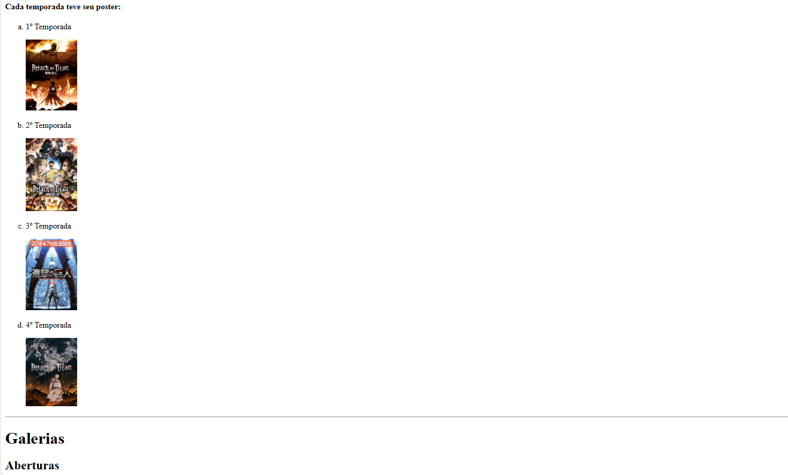

# ativHTMLPuro-Shingeki
atividade de HTML no começo do curso. o tema escolhido foi shingeki no kyoujin. esse é HTML puro e era bem no começo, não tínhamos muito conhecimento de Web. 
 

  <h3>Começo da aprendizagem de HTML</h3>
  

  

  <h3>Imagens das temporadas</h3>
  

  

  <h3>Vídeos baixados do Youtube</h3>
  

  

  <h3>Elementos do SoundCloud</h3>
  

  

  <h3>Os titãs originais</h3>
  

  

  <h3>Mais titãs</h3>
  

  

  <h3>O resto dos titãs</h3>
  

  

  <h3>Tem um botão para o topo</h3>
  

  
